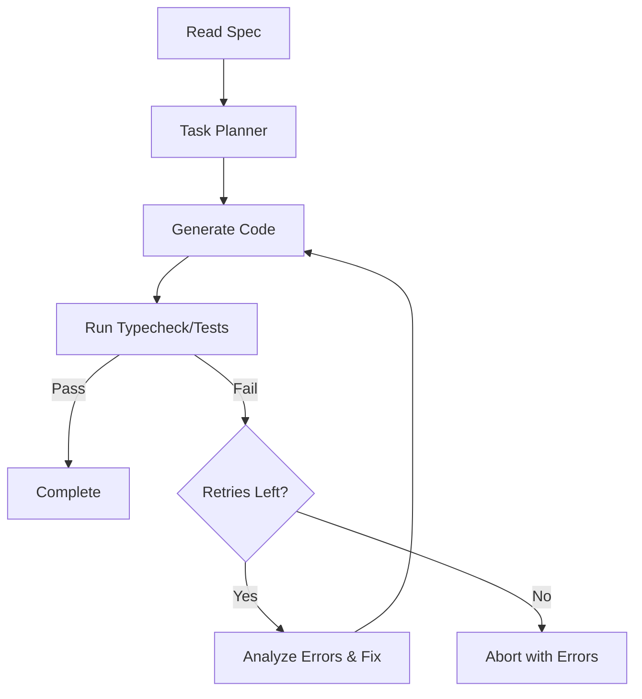

# Agentic Frontend Code Generator

This repository contains an autonomous agent designed to read a natural-language specification and generate a fully functional React + TypeScript application within an existing boilerplate. 

## Table of Contents
1. [Submission Deliverables](#submission-deliverables)
2. [Setup Instructions](#setup-instructions)
3. [Usage](#usage)
4. [Architecture & Design Decisions](#architecture--design-decisions)
5. [Write-up (LLMs, Cost, Retrospective)](#write-up)

---

## Submission Deliverables

- **Agent Source Code**: Located in the `/agent` directory.
- **Generated Application**: Located in the `/frontend` directory (the generated Car Inventory Manager).
- **Sample Spec File**: `spec.txt` in the agent's directory.
- **Environment File**: `agent/.env.example` shows the required API keys.

---

## Setup Instructions

1. **Install Frontend Dependencies:**
   ```bash
   cd frontend
   npm install
   ```

2. **Run the Generated App:**
   ```bash
   npm run dev
   ```
   The application will be available at `http://localhost:5173`. You can also run `npm run typecheck` and `npm run test` to verify the generated tests and types.

3. **Set Up the Agent (Optional, if you wish to run it again):**
   ```bash
   cd ../agent
   npm install
   cp .env.example .env
   ```
   *Note: Add your `OPENAI_API_KEY` inside `agent/.env`.*

---

## Usage

To run the agent and generate code into the frontend boilerplate based on a specification:

```bash
cd agent
npm start ../spec.txt
```

---

## Architecture & Design Decisions

### Agent Architecture Overview

The agent is built using a modular architecture utilizing LangGraph to manage the state machine and loop.

1. **Planner (`core/planner.ts`)**: Takes the raw `spec.txt` and the state of the workspace. It breaks the specification down into a clear dependency graph of files that need to be created or modified.
2. **Executor/Generator (`core/generator.ts`)**: Generates each file individually in topological order. It is provided context from previously generated code to ensure consistent imports and logic.
3. **Validator (`core/validator.ts`)**: Shells out to execute `npm run typecheck && npm run test` inside the target directory.
4. **Retry Loop (`core/agent.ts`)**: If validation fails, the compiler or test runner output is captured and fed back to the LLM to fix the generated code. A LangGraph conditional edge handles up to 2 retry iterations before cleanly aborting or succeeding.



### Design Decisions

- **Modularity:** The agent code was split into `/core` (logic), `/services` (API interactions), and `/shared` (types/utils). This ensures the codebase is maintainable and testable.
- **Step-by-Step Generation:** Instead of generating the entire app in one go, the agent creates a dependency graph. This significantly reduces the context window cognitive load on the LLM and reduces syntax hallucination.
- **Self-Validation:** By natively running `tsc` and `vitest` in the background, the agent proves its own code works before calling the job done.

---

## Write-up

### Which LLM(s) Used and Why
We used **OpenAI `gpt-4o-mini`** for the core agentic generation loops. 
- **Why?** It strikes the optimal balance between speed, cost, and coding proficiency. For file-by-file code generation where context sizes can grow quickly due to appending previously generated files, a fast and highly capable model is required to iterate quickly through the self-healing retry loops. We initially experimented with Gemini, but transitioned to OpenAI to bypass strict quota limits during intensive retry cycles.

### What Worked Well
- **LangGraph State Management:** Explicitly modeling the agent's state transitions made it easy to implement the retry logic and track exactly which file the agent was working on.
- **Component-Level Generation:** Building the application component-by-component ensured very high code quality compared to a single-shot generation approach.

### What to Improve With More Time
- **Parallel Generation:** Right now, the agent generates files sequentially. With a better dependency graph parser, independent files (e.g., disjoint React components) could be generated in parallel to speed up execution.
- **Finer-Grained Error Feedback:** Currently, the agent gets the entire stdout/stderr dump from `tsc`/`vitest`. Parsing the errors to only feed back the most relevant stack trace would reduce token usage.
- **AST-based editing:** Instead of overwriting files, the agent could use tools to perform targeted edits via AST or line-replacements, saving output tokens.

### Approximate Cost Per Run
- **Tokens Used:** ~40,000 to 60,000 prompt tokens (depending on retry loops) and ~5,000 completion tokens.
- **API Cost:** At $0.15/1M input and $0.60/1M output for `gpt-4o-mini`, a full run of the Car Inventory Manager app costs roughly **$0.01 to $0.02**.
